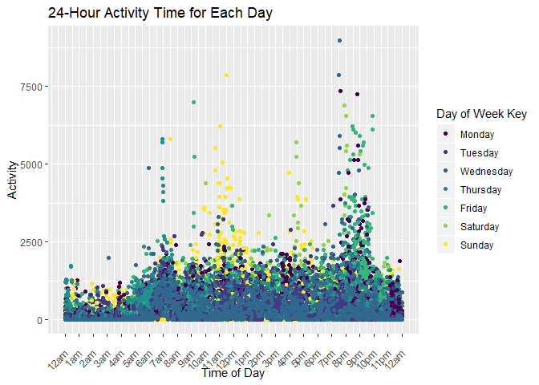

p8105\_hw3\_mrc2229
================
Matthew Curran
October 12, 2019

Problem 1
=========

Bring in instacart data
-----------------------

``` r
library(p8105.datasets)
data("instacart")
```

Examining the instacart data
----------------------------

There are 1384617 observations in the instacart dataset and 15 variables in the instacart data set. Some of the key variables are product\_name, which shows the product purchased; aisle, which tells us the aisle the purchased item comes from; and order\_id, which tells us the id of the person who ordered a certain item. So we can see things like that person with order\_id 1 got 2 items from aisle 24, the fresh fruit aisle. The instacart dataset also gives information on the time an order was placed. As an example, the person with order\_id 1 made their order at the 10th hour of the day.

Examining the aisles
--------------------

There are 134 aisles in total and the most items are ordered from the fresh vegetables and fresh fruits aisles.

Plot of number of items ordered in each aisle
---------------------------------------------

``` r
items_per_aisle_plot = instacart %>%
  count(aisle,name="aisle_count") %>%
  filter(aisle_count>10000) %>%
  arrange (desc(aisle)) %>%
  ggplot(aes(x=aisle, y=aisle_count)) +
  geom_bar(stat="identity", fill="blue") +
  labs(
    title = "Ammount of Items Purchased in Each Aisle",
    x = "Aisle",
    y ="Ammount of Items Purchased"
  )

items_per_aisle_plot + coord_flip()
```


Table of most popular items in "baking ingrediant", "dog food care", and "packaged vegatables fruits"
-----------------------------------------------------------------------------------------------------

``` r
most_popular_items = instacart %>%
  select(aisle,product_name) %>%
  filter(
    aisle == "baking ingredients"|
    aisle == "packaged vegetables fruits"|
    aisle == "dog food care"
    ) %>%
  group_by(aisle) %>%
  count(product_name,name="product_count")%>%
  mutate(product_count_rank = rank(desc(product_count))) %>% 
  filter (product_count_rank < 4) %>%
  arrange(aisle, product_count_rank) %>%
  select(aisle, product_count_rank, product_name, product_count) %>%
  kable()
  
most_popular_items
```

| aisle                      |  product\_count\_rank| product\_name                                 |  product\_count|
|:---------------------------|---------------------:|:----------------------------------------------|---------------:|
| baking ingredients         |                     1| Light Brown Sugar                             |             499|
| baking ingredients         |                     2| Pure Baking Soda                              |             387|
| baking ingredients         |                     3| Cane Sugar                                    |             336|
| dog food care              |                     1| Snack Sticks Chicken & Rice Recipe Dog Treats |              30|
| dog food care              |                     2| Organix Chicken & Brown Rice Recipe           |              28|
| dog food care              |                     3| Small Dog Biscuits                            |              26|
| packaged vegetables fruits |                     1| Organic Baby Spinach                          |            9784|
| packaged vegetables fruits |                     2| Organic Raspberries                           |            5546|
| packaged vegetables fruits |                     3| Organic Blueberries                           |            4966|

Table showing day and time Pink Lady Apples and Coffee Ice Cream are ordered
----------------------------------------------------------------------------

``` r
pink_lady_coffee = instacart %>%
  filter(
  product_name == "Pink Lady Apples"|
  product_name == "Coffee Ice Cream"
  ) %>%
  arrange (product_name, order_dow) %>%
  mutate(
    order_dow = 
    recode(order_dow,
    "0" = "Sunday",
    "1" = "Monday",
    "2" = "Tuesday",
    "3" = "Wednesday",
    "4" = "Thursday",
    "5" = "Friday",
    "6" = "Saturday")
    ) %>%
   mutate(order_dow = fct_relevel(order_dow, "Sunday", "Monday", "Tuesday", "Wednesday", "Thursday", "Friday", "Saturday")) %>%
  group_by(product_name,order_dow) %>%
  summarise(mean_hour_of_day=mean(order_hour_of_day)) %>%
  separate(mean_hour_of_day, into = c("hour", "minutes"), sep = 2) %>%
  mutate(minutes = as.numeric(minutes),
         minutes = round(minutes*60, digits = 0),
         hour = as.numeric(hour),
         mean_time_of_day = paste(hour,minutes,sep = ":")) %>%
  select(product_name, order_dow, mean_time_of_day) %>%
  pivot_wider(
    names_from = order_dow,
    values_from = mean_time_of_day
  ) %>%
  rename(Product=product_name) %>%
  kable()

pink_lady_coffee
```

| Product          | Sunday | Monday | Tuesday | Wednesday | Thursday | Friday | Saturday |
|:-----------------|:-------|:-------|:--------|:----------|:---------|:-------|:---------|
| Coffee Ice Cream | 13:46  | 14:19  | 15:23   | 15:19     | 15:13    | 12:16  | 13:50    |
| Pink Lady Apples | 13:26  | 11:22  | 11:42   | 14:15     | 11:33    | 12:47  | 11:56    |

Problem 2
=========

Bring in and clean BRFSS data
-----------------------------

``` r
library(p8105.datasets)
data("brfss_smart2010")
brfss_data = brfss_smart2010 %>%
  janitor::clean_names() %>%
  filter(topic == "Overall Health" |
  response == "Poor"|
  response == "Fair"|
  response == "Good"|
  response == "Very good"|
  response == "Excellent"
  ) %>%
  mutate(response = fct_relevel(response, "Poor", "Fair", "Good", "Very good", "Excellent"))
```

States with 7 or more locations
-------------------------------

``` r
state_locations = brfss_data %>%
  filter(year == 2002 | year ==2010) %>%
  group_by(year, locationabbr) %>%
  summarise(number_of_state_locations = n_distinct(locationdesc)) %>%
  filter (number_of_state_locations >= 7)
```

In 2002, 6 states had 7 or more locations.Those states were CT, FL, MA, NC, NJ, and PA.

In 2010, 14 states had 7 or more locations.Those states were CA, CO, FL, MA, MD, NC, NE, NJ, NY, OH, PA, SC, TX, WA.

An "Excellent" response only dataset and speghetti plot.
--------------------------------------------------------

``` r
excellent_data = brfss_data %>%
  filter (response == "Excellent") %>%
  group_by(year,locationdesc) %>%
  mutate(ave_data_value = mean(data_value, na.rm = TRUE)) %>%
  ungroup(locationdesc) %>%
  select(year, locationabbr, ave_data_value) %>%
  distinct() %>%
  drop_na()%>%
  ggplot(aes(x=year,y=ave_data_value))+
  geom_line(aes(group=locationabbr, color=locationabbr))+
  scale_color_viridis(
    discrete = TRUE,
    name = "State Color Key"
  )+
  labs(
    title = "Average Data Value over Time within a State",
    x = "Year",
    y ="Average Data Value (%)"
  ) 
  
excellent_data
```


NY State distribution of data values for each responce type in 2006 and 2010
----------------------------------------------------------------------------

``` r
NYS_data = brfss_data %>%
  filter(year == 2006 | year == 2010) %>%
  filter (locationabbr == "NY") %>%
  ggplot(aes(x=locationdesc, y=data_value, fill=response))+
  geom_bar(stat = "identity", position = "dodge")+
  facet_grid(~year)+
  labs(
    title = "Data Values for Responses among Locations in NY State for 2006 and 2010",
    x = "NY State County",
    y = "Response Percentages"
  ) 

NYS_data + coord_flip()
```


Problem 3
=========

Read in and clean Accelerometer Data
------------------------------------

``` r
accel_data = read.csv("./hw3_data/accel_data.csv") %>%
  janitor::clean_names() %>%
  pivot_longer(
    activity_1:activity_1440,
    names_to = "activity_minute",
    values_to = "activity_count",
    names_prefix = "activity_"
    ) %>%
  mutate (
    weekday_or_weekend = case_when ((day == "Friday" | day == "Saturday" | day == "Sunday") ~ "Weekend",
    TRUE ~ "Weekday"),
    activity_minute = as.integer(activity_minute)
  )
```

The accelerometer dataset contains 50400 observations and 6 variables. The data contains five weeks of accelerometer data and the "week" variable shows which of those five weeks that data was collected from. The "day" variable gives the day of the week and "day\_id" is a numeric identifier for a specfic day of the 5 week collecion of data. "activity\_minute" gives every minute of the day and "activity\_count" measures activity in that minute. "weekday\_or\_weekend" tells us if that day was a weekday or a weekend.

Activity over ever day
----------------------

``` r
day_activity=accel_data %>%
  group_by(day_id) %>%
  summarise("total_activity_for_day" = sum(activity_count)) %>%
  kable()

day_activity
```

|  day\_id|  total\_activity\_for\_day|
|--------:|--------------------------:|
|        1|                  480542.62|
|        2|                   78828.07|
|        3|                  376254.00|
|        4|                  631105.00|
|        5|                  355923.64|
|        6|                  307094.24|
|        7|                  340115.01|
|        8|                  568839.00|
|        9|                  295431.00|
|       10|                  607175.00|
|       11|                  422018.00|
|       12|                  474048.00|
|       13|                  423245.00|
|       14|                  440962.00|
|       15|                  467420.00|
|       16|                  685910.00|
|       17|                  382928.00|
|       18|                  467052.00|
|       19|                  371230.00|
|       20|                  381507.00|
|       21|                  468869.00|
|       22|                  154049.00|
|       23|                  409450.00|
|       24|                    1440.00|
|       25|                  260617.00|
|       26|                  340291.00|
|       27|                  319568.00|
|       28|                  434460.00|
|       29|                  620860.00|
|       30|                  389080.00|
|       31|                    1440.00|
|       32|                  138421.00|
|       33|                  549658.00|
|       34|                  367824.00|
|       35|                  445366.00|

Based on this table there are no trends that jump out at first glance.

``` r
day_activity_plot=accel_data %>%
  mutate(day = fct_relevel(day, "Monday", "Tuesday", "Wednesday", "Thursday", "Friday", "Saturday", "Sunday")) %>%
  group_by(day_id, day, activity_minute) %>%
  ggplot(aes(x=activity_minute,y=activity_count))+
  geom_line(aes(group=day_id, color=day))+
  scale_color_viridis(
    discrete = TRUE,
    name = "Day of Week Key"
  )+
  labs(
    title = "24-Hour Activity Time for Each Day",
    x = "Minute of The Day",
    y ="Activity"
  )

day_activity_plot
```



It appears that activity is typically higher from about the 600th to 750th minute on Sundays and from about the 1200th to 1300th minute on Fridays and Saturdays. Very late at night (after the 1400th minute) and early mornings (from the 0th minute to the 300th minute) seem to have the lowest activity.
